># 终极任务 课程设计
>## 一、实验背景
>综合运用目前已经学习的知识，按照《Web开发Ⅰ课程设计要求》完成并提交课程设计。
>## 二、实验目的
>1. 熟练掌握HTML在组织结构上的优势。
>2. 熟练掌握CSS在网页布局中的应用。
>3. 制作一个由图片形成的软件学院学生会的网页，实现以下效果>图（共五个网页，未显示顶部和底部）
>
>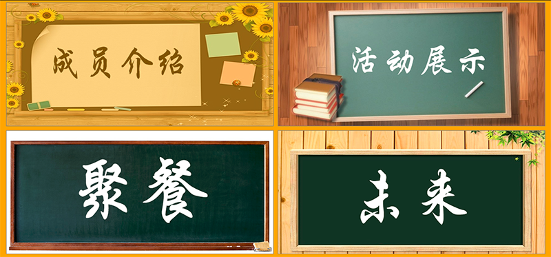
>
>图2-1首页效果图
>
>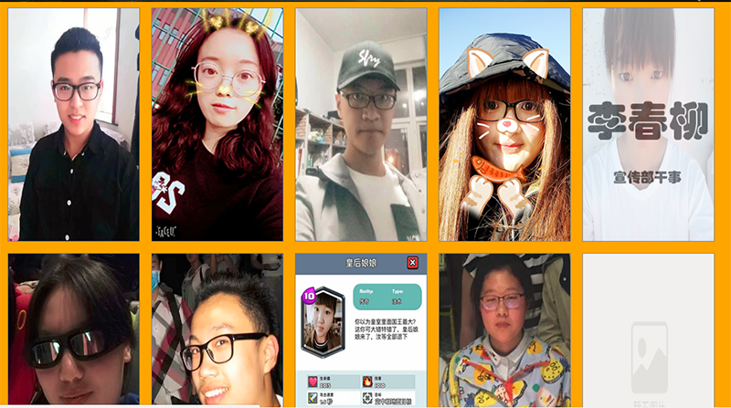
>
>图2-2网页效果图
>
>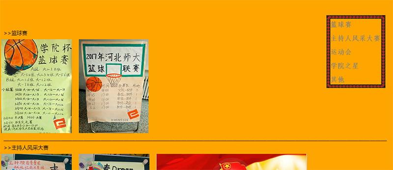
>
>图2-3网页效果图
>
>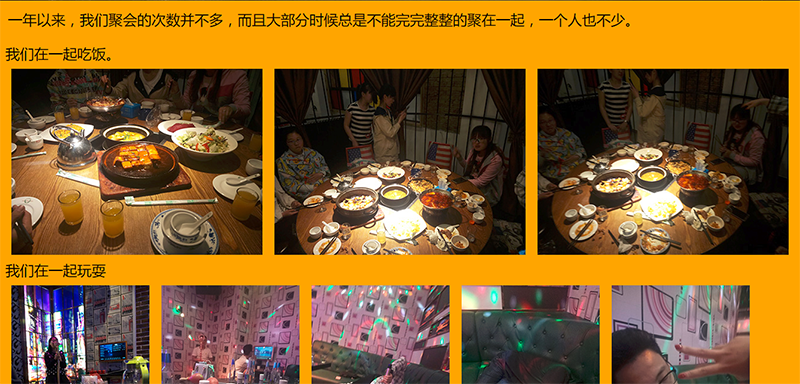
>
>图2-4网页效果图
>
>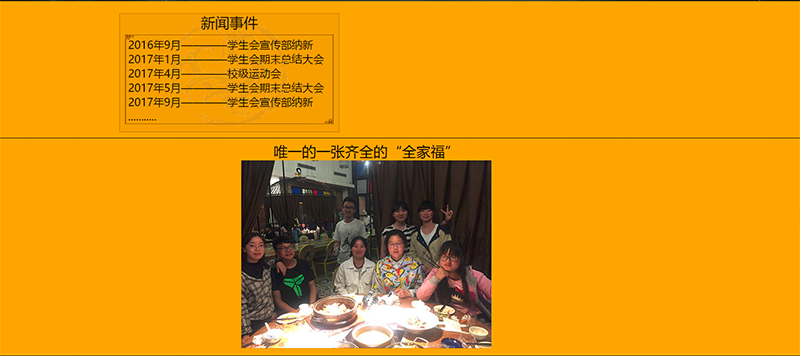
>
>图2-5网页效果图
>
>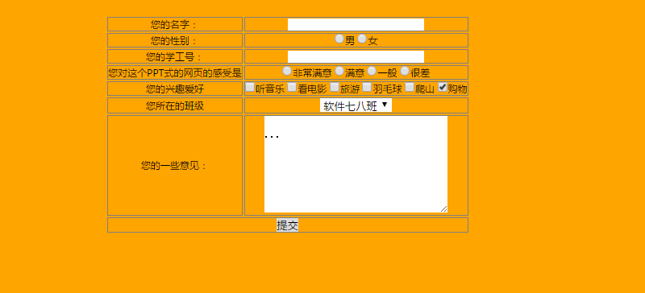
>
>图2-4网页效果图
>## 三、准备材料
>本实验目录结构如下:
>
>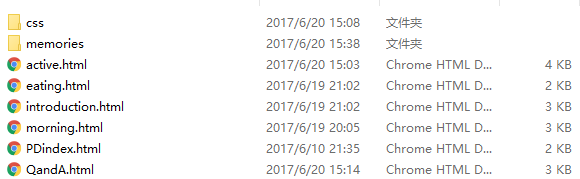
>
>图3-1文件目录结构
>
>memories文件夹存放本实验中用到的图片， css文件统一放到css文件夹中。
>>## 四、实验步骤
>### 步骤1.分析网页的效果图，确定网页结构，即网页分为几块。分块的原则:从上到下，从左到右，从大到小。
>### 步骤2.按照从整体到局部，从大到小的原则用HTML实现网页结构。其中网页的顶部Logo、导航栏和底部页脚可以复用首页的代码。
>
>网页的顶部：
>
>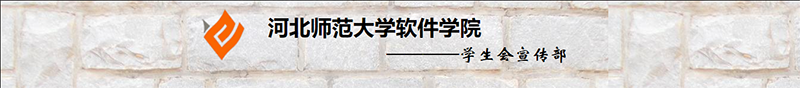
>
>图4-1
>
>网页导航栏：
>
>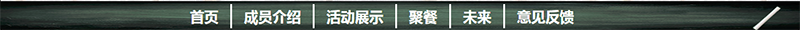
>
>图4-2
>
>网页底部：
>
>
>
>图4-3
>### 步骤3.用CSS实现网页结构布局，设置页面的整体效果。设置“页面顶部”样式。复用首页代码。设置“页脚”部分样式。复用首页代码。
>
>css通用代码如下：
>
>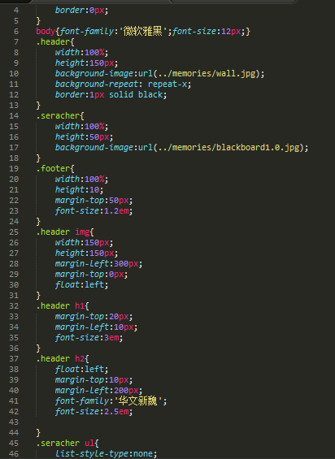
>### 步骤4.对每一个网页进行单独的编写
>
>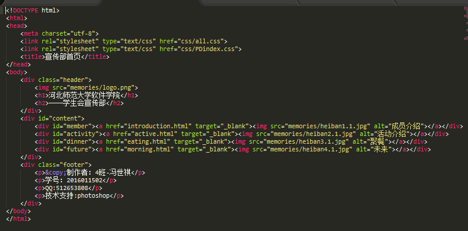
>
>图4-4网页1的html代码
>
>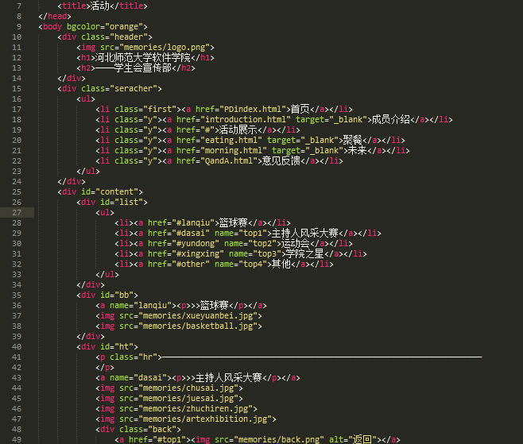
>
>图4-5网页2的html代码
>
>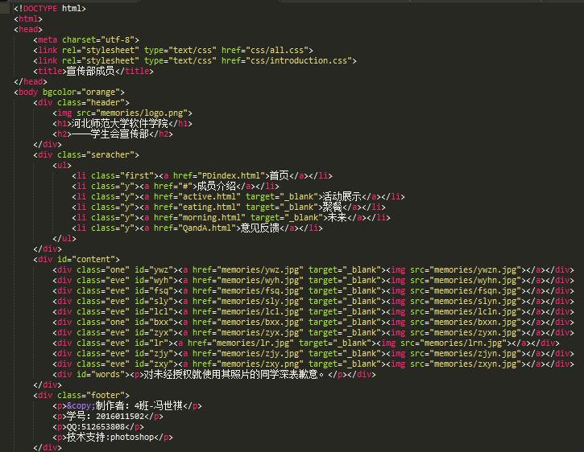
>
>图4-6网页3的html代码
>
>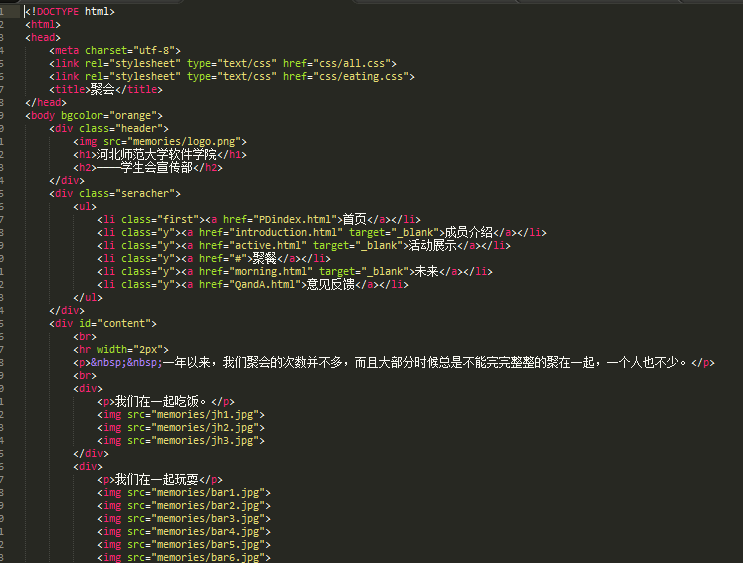
>
>图4-7网页4的html代码
>
>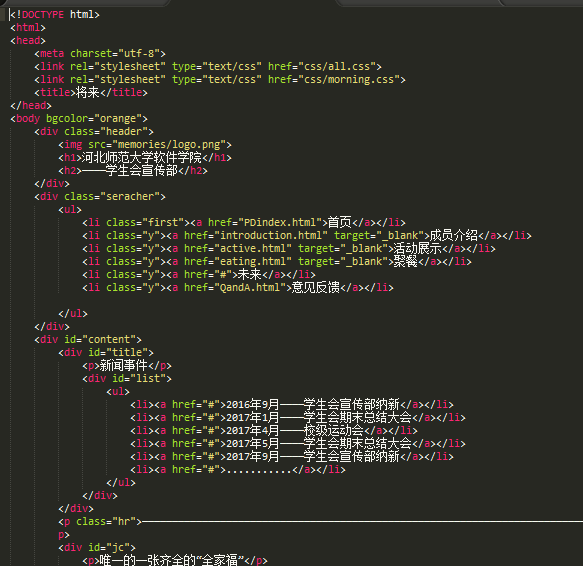
>
>图4-8网页5的html代码
>
>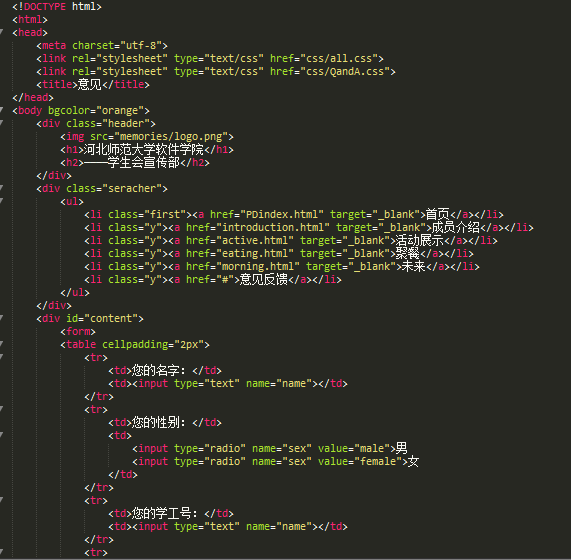
>
>图4-9网页6的html代码（该代码使用了\<table>标签）
## 五、推荐阅读

1. div+css布局模板: http://www.cssmoban.com/cssthemes/

2. w3school：http://www.w3school.com.cn/css/index.asp
